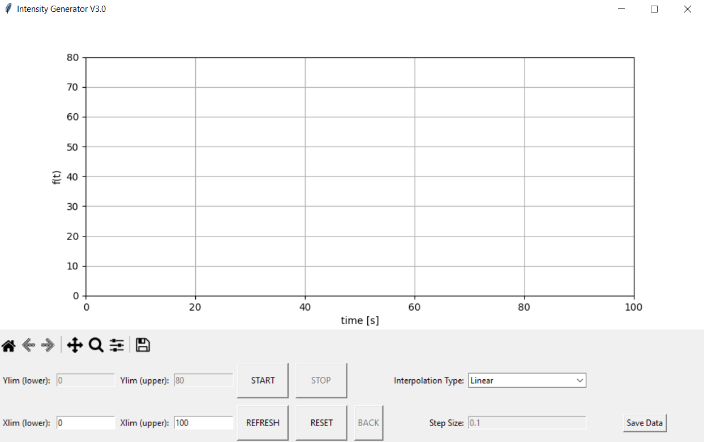
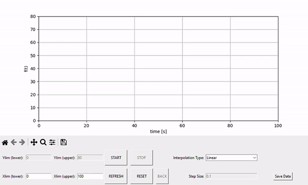

# Light-Intensity-Project-Code
Repository for the GUI and Arduino system.\
Written by maxims@vt.edu 

## Table of contents
* [General info](#general-info)
* [GUI Curve Generator](#gui-curve-generator)
* [Arduino System](#arduino-system)

## General info
The light intensity tester consists of two parts:
1. The GUI used to create the user-defined curve
2. The Arduino microcontroller used to generate the light
	
## GUI Curve Generator
The GUI program is written entirely in Python. The GUI is created using Tkinter while the plotting system uses MatPlotlib. 
To create a curve, follow this process:  
1. Run the *MainFile.py* file for the GUI. Make sure *MainFile.py* and *SettingsFile.py* are in the same folder. 

2. First, the GUI has Xlim(lower) and Xlim(upper) changeable values. These values can be changed to vary the length of the x-axis (time). If making a change, make sure to click the **Refresh** button to save the changes. After saving the x-axis limits, clicking the **Start** button begins the plotter. When in this mode, all other actions are disabled. By default, the interpolation mode between two consequent points is set to **Linear**. This can be changed to **Polynomial** for smooth curve generation. Additionally, the **Back** button allows the previous point to be deleted. This button cannot be used on the first point. Instead, clicking **Reset** allows for the original point to be deleted. Note that if the first point is Polynomial, the back button cannot be used to delete that first segement. 
  
	
## Arduino System
The arduino system is written entirely in C. 
