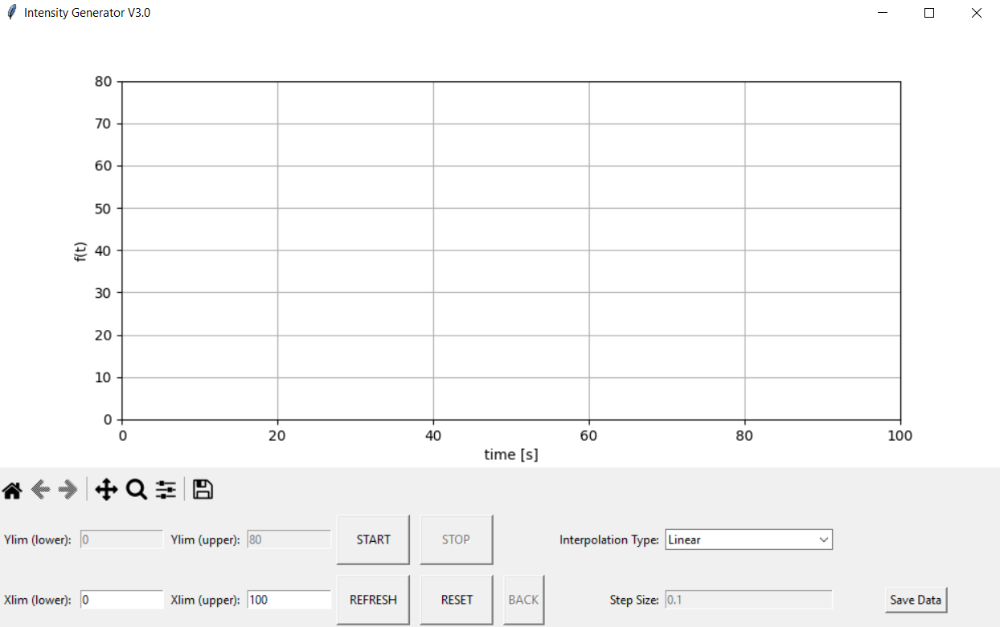
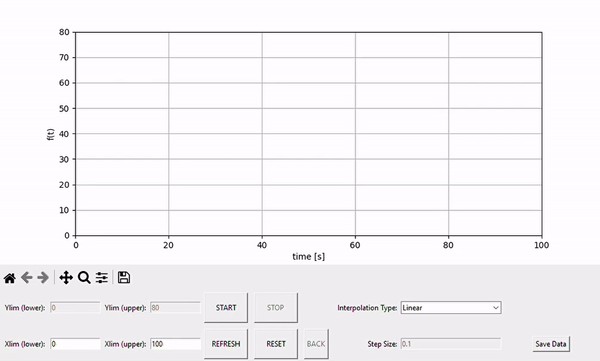
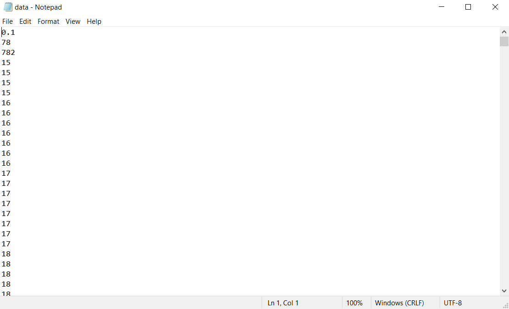
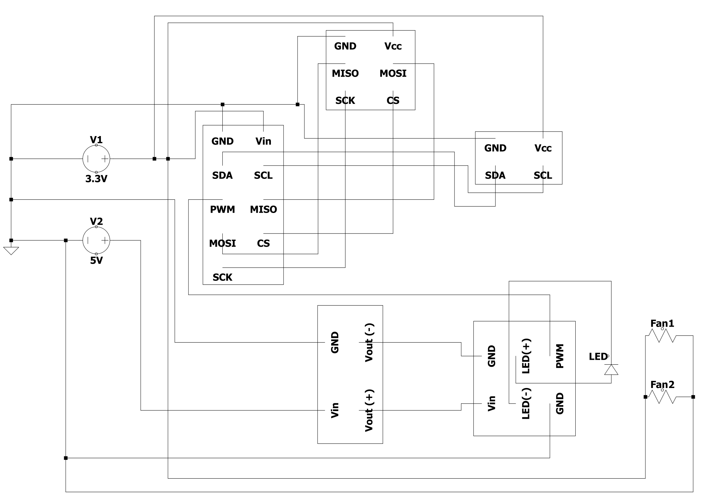

# Light-Intensity-Project-Code
Repository for the GUI and Raspberry Pi system.\
Written by maxims@vt.edu 

## Table of contents
* [General info](#general-info)
* [GUI Curve Generator](#gui-curve-generator)
* [Raspberry Pi System](#Raspberry-Pi-system)

## General info
The light intensity tester consists of two parts:
1. The GUI used to create the user-defined curve
2. The Raspberry Pi microcontroller used to generate the light
	
## GUI Curve Generator
The GUI program is written entirely in Python. The GUI is created using Tkinter while the plotting system uses MatPlotlib. 
To create a curve, follow this process:  
1. Run the *MainFile.py* file for the GUI. Make sure *MainFile.py* and *SettingsFile.py* are in the same folder. 

2. First, the GUI has Xlim(lower) and Xlim(upper) changeable values. These values can be changed to vary the length of the x-axis (time). If making a change, make sure to click the **Refresh** button to save the changes. After saving the x-axis limits, clicking the **Start** button begins the plotter. When in this mode, all other actions are disabled. By default, the interpolation mode between two consequent points is set to **Linear**. This can be changed to **Polynomial** for smooth curve generation. Additionally, the **Back** button allows the previous point to be deleted. This button cannot be used on the first point. Instead, clicking **Reset** allows for the original point to be deleted. Note that if the first point is Polynomial, the back button cannot be used to delete that first segement. 

3. Saving data can be used the **Save Data** button at the bottom right of the GUI. Clicking this button will result in a *.txt* file generation in the same folder as the *.py* files. This *.txt* file is called *data.txt* and consists of 3 calibration variables followed by the dynamic data. The calibration variables are the step size, the program duration in seconds, and the total number of data points, respectively from the top down. In the provided example below, the step size is **0.1**, the program duration is **78** seconds, and the number of data points is **782**. 

> [!WARNING]
> Although the GUI is functional, there are some hard-coded limitations:
> 1. The step size is limited to 0.1 seconds. This is a hardware-based limit so that the Raspberry PI `delay()` function is not overwhelemed. It is probably possible to push this to 0.05 seconds - not tried yet.
> 2. The y-axis, and subsaquent interpolation, is limited between 0 and 80. This is because the LED Driver supports a max current of 900mA. However, the LED itself is limited to 300mA. The Raspberry Pi PWM `analogWrite()` function has a range of 0-255. This means that the current resolution is: $\frac{900mA}{256} \approx 3.5mA $. Since the maximum current for the LED is 300mA, the step limitation is then $\frac{300mA}{3.5mA} \approx 85mA$. Considering a factor of safety of about 5\%, the y-axis step size is then limited to between 0 (0mA) and 80 (~281mA).
> 3. The output data is saved in a *.txt* file. A possible rewrite of the `def save_file():` function can be done to support *.csv* which may be faster than the current *.txt* format.

> [!CAUTION]
> Coding issues that may cause a headache: 
> 1. If starting the plot in the *Polynomial* mode, this curve cannot be deleted using the **Back** button. Instead, the **Reset** button needs to be pressed.
> 2. The refresh button needs to be pressed anytime the Xlims are changed. 

## Raspberry Pi System
The Raspberry Pi system is written entirely in C (Raspberry Pi C). 
The system works by loading the *data.txt* file and reading the first 3 data points for calibration (Static Values). The system then reads the luminosity magnitude making sure to "sleep" according to the step size provided by the GUI.  
  
Circuit diagram for the system:
