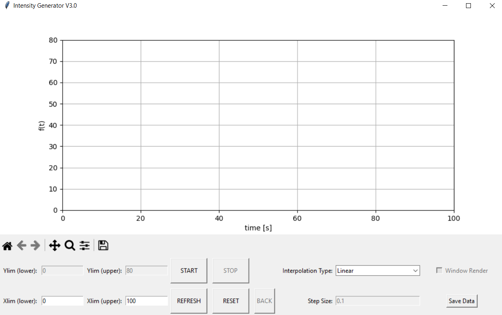

# Light-Intensity-Project-Code
Repository for the GUI and Arduino system.\
Written by maxims@vt.edu 

## Table of contents
* [General info](#general-info)
* [GUI Curve Generator](#gui-curve-generator)
* [Arduino System](#arduino-system)

## General info
The light intensity tester consists of two parts:
1. The GUI used to create the user-defined curve
2. The Arduino microcontroller used to generate the light
	
## GUI Curve Generator
The GUI program is written entirely in Python. The GUI is created using Tkinter while the plotting system uses MatPlotlib. 
To create a curve, follow this process:  
<ul>
<b> 1. </b> Run the Python file for the GUI. Make sure <i> MainFile.py </i> and <i> SettingsFile.py </i> are in the same folder. The GUI should look like this:  
  
</ul>
	
## Arduino System
The arduino system is written entirely in C. 
